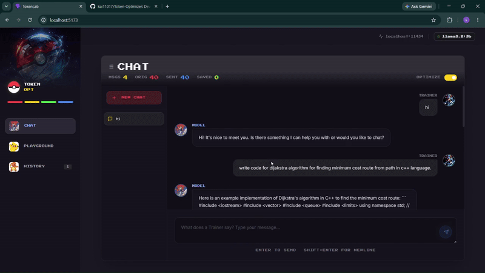
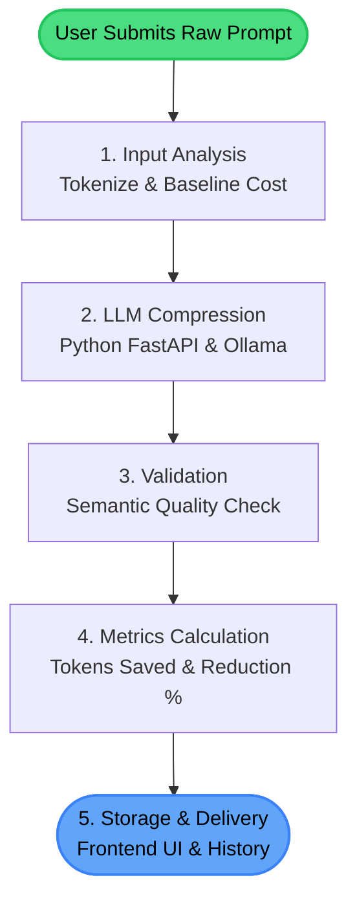

# Token Optimizer (TokenLab) Architecture & Overview

## Demo



## What This Website Does
TokenLab is a specialized platform designed to compress, optimize, and analyze LLM (Large Language Model) prompts. It reduces the token count of prompts while preserving their semantic meaning and intent. This helps developers and prompt engineers save on API costs and fit more information into limited LLM context windows.

The application provides:
- A **Chat Interface** for real-time testing of prompts.
- A **Playground (Prompt Lab)** for directly comparing original and optimized prompts, viewing token savings, and analyzing reduction ratios.
- An **Experiment History** tracking past optimizations, token savings, and overall compression metrics.

## The Optimization Pipeline
When a user submits a prompt, it goes through a multi-step pipeline:

1. **Input Analysis**: The raw prompt is sent to the backend, where it is tokenized to determine the baseline cost and length.
2. **LLM-Based Compression**: The backend (Python/FastAPI) uses a local LLM (like Llama 3 via Ollama) to semantically compress the prompt. The model is specifically instructed to replace verbose phrasing with shorthand (e.g., "$PY" for Python, "$FN" for function) and strip non-essential filler words.
3. **Validation & Quality Check**: The optimized prompt is compared against the original to ensure core instructions and intent were not lost during compression. This is verified by computing semantic similarity using the `all-MiniLM-L6-v2` model via `sentence-transformers`.
4. **Metrics Calculation**: The system calculates the new token count, the raw number of tokens saved, and the percentage reduction ratio.
5. **Storage & Delivery**: The final optimized prompt and its associated metrics are returned to the frontend (and saved to local history) for the user to review.



## Tech Stack & Rationale

### Frontend
- **React (Vite)**: Chosen for its fast development server, HMR (Hot Module Replacement), and component-based architecture which makes building interactive UI elements (like the Playground and Chat) highly efficient.
- **Tailwind CSS**: Used for rapid UI styling. It allows for highly customized, utility-first designs without leaving the HTML/JSX. The project features a distinct dark, retro, "Pokémon-inspired" aesthetic utilizing custom CSS variables and Tailwind extensions.
- **TypeScript**: Provides static typing to catch errors at compile-time, ensuring robust data handling for complex objects like experiment history and API responses.
- **Lucide-React**: A clean, lightweight icon library that fits the modern aesthetic of the application.

### Backend
- **Node.js (Express)**: Acts as the primary API Gateway, serving as a lightweight and fast middle layer to handle CORS, routing, and basic request validation.
- **Python (FastAPI)**: Runs the core `optimizer_pipeline.py`. Python is the industry standard for AI/ML tasks, and FastAPI provides high performance and automatic API documentation for the Python microservice.
- **Ollama (Llama 3)**: Runs the LLM locally. This ensures privacy, zero API costs during development, and low latency for the actual prompt compression tasks.
- **Sentence Transformers**: Utilizes the `all-MiniLM-L6-v2` model in the Python backend to compute cosine similarity scores, ensuring the optimized prompt retains the original semantic meaning.

## How to Run the Project

This project consists of three main components that need to run concurrently: the Python AI service, the Node.js API Gateway, and the React frontend.

### 1. Python FastAPI Backend (AI Service)
The Python backend handles the core LLM optimization logic.
```bash
# Create and activate a virtual environment (optional but recommended)
python -m venv .venv
# On Windows:
.venv\Scripts\activate
# On Mac/Linux:
source .venv/bin/activate

# Install dependencies
pip install fastapi uvicorn pydantic

# Run the server from the root directory
python -m uvicorn agents.main:app --host 0.0.0.0 --port 8000
```

### 2. Node.js Backend (API Gateway)
The Node API handles routing, CORS, and automatically spins up Ollama for the Llama 3 model.
```bash
cd backend
npm install
node server.js
```
*Note: Make sure you have [Ollama](https://ollama.com/) installed on your machine so the Node server can start it successfully.*

### 3. Frontend (React / Vite)
The Vite server serves the actual UI.
```bash
cd frontend
npm install
npm run dev
```
Once all three servers are running, simply open the `localhost` URL provided by Vite (usually `http://localhost:5173`) in your browser!

## Sample Results

TokenLab typically achieves a significant reduction in token count depending on the verbosity of the original prompt, without degrading the LLM's understanding of the task.

**Example 1: Code Generation**
* **Original Prompt:** "Can you please write a Python script that takes a list of numbers and returns the sum of all the even numbers in the list? Please include comments explaining how it works." *(34 tokens)*
* **Optimized Prompt:** "Python script sum even numbers in list include comments." *(9 tokens)*
* **Reduction:** ~73% (25 tokens saved)

**Example 2: Text Summarization**
* **Original Prompt:** "I have a long article about the history of the Roman Empire. I need you to read it and provide me with a concise summary of the main points, focusing specifically on the fall of the empire." *(38 tokens)*
* **Optimized Prompt:** "Summarize Roman Empire article focus fall of empire." *(8 tokens)*
* **Reduction:** ~78% (30 tokens saved)

**Example 3: General Question**
* **Original Prompt:** "What are the main differences between React and Vue.js for building web applications, and which one is better for beginners?" *(21 tokens)*
* **Optimized Prompt:** "Compare React vs Vue.js for web apps, best for beginners?" *(11 tokens)*
* **Reduction:** ~47% (10 tokens saved)
